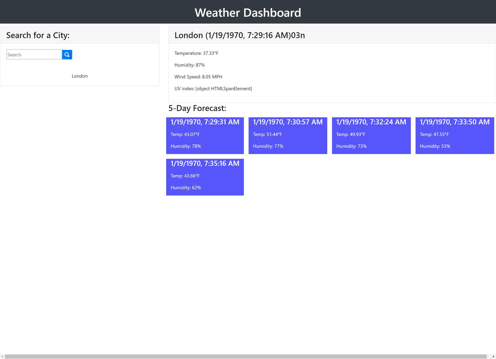

# Weather Dashboard

Weather Dashboard is an application that allows a user to search for a city and then displays that city's 5-day weather forecast. 

 
## Files and Directories
There is a gitignore file. The js, css, and images folders live in the assets directory.

## Publishing
The website is published using github pages.

## Link to application
[Click here to visit the Weather Dashboard!](https://mymy-4242.github.io/weather-challenge6/)